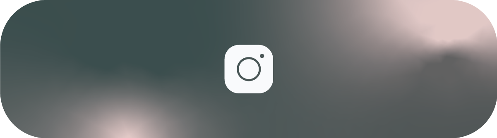

<!-- Top Banner (Card01) -->

  

<!-- Middle Row: Repositories + Portfolio (Card02 + Card03) -->

  
  &nbsp;&nbsp;
  

<!-- Bottom Row: Stick for More + K-arné (Card04 + Card05) -->

  
  &nbsp;&nbsp;
  

<!-- Social Media Cards - Horizontal row -->

  
  &nbsp;&nbsp;
  
  &nbsp;&nbsp;
  

